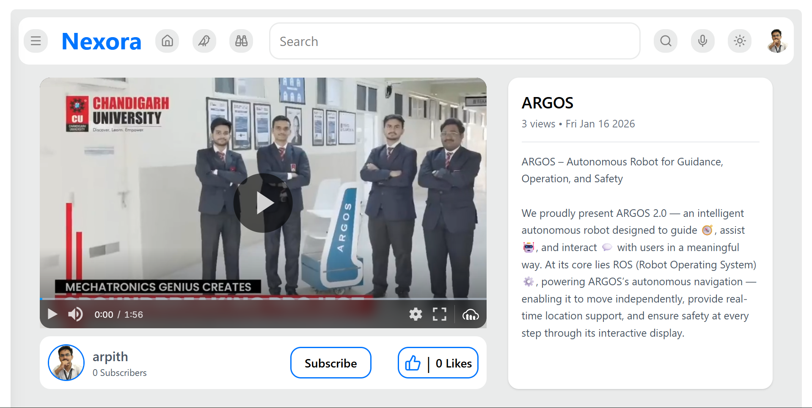
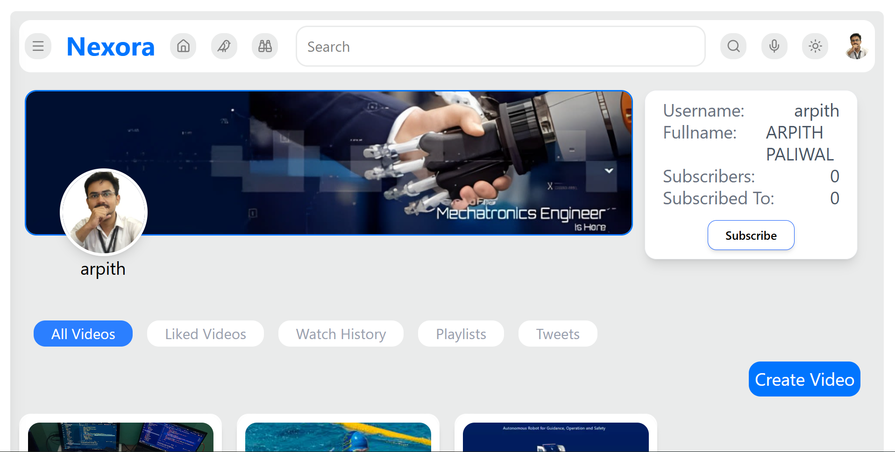

# 🚀 Nexora  
### *A Nexus of Ideas, A Radiance of Potential*

---

## 📌 Description  

**Nexora** is a full-stack, feature-rich video sharing platform inspired by YouTube. It provides a complete ecosystem for users to upload, share, and interact with video content.

The project is built using a modern **MERN-like stack**, featuring a **React** frontend and a **Node.js / Express** backend. Nexora showcases real-world production-level architecture, scalable API design, and advanced content management workflows.

Nexora is designed to simulate a real video platform with performance, modularity, and user experience as core priorities.


## ✨ Features  

### 🔐 User & Authentication  
- Secure JWT-based authentication (Access & Refresh Tokens)  
- User registration, login, and logout  
- Encrypted password storage using bcrypt  

---

### 📹 Video Management  
- Seamless video & thumbnail uploads via Cloudinary  
- Hover-based video preview player  
- Full CRUD operations for videos  
- Optimized video delivery  

---

### 📊 User Dashboard  
A centralized control panel to manage:  
- Uploaded videos  
- Created playlists  
- Liked videos  
- Posted tweets  
- Complete watch history  

---

### 🤝 Social Engagement  
- Subscribe / Unsubscribe to channels  
- Like / Unlike videos and comments  
- Nested commenting system for discussions  

---

### 📂 Playlist System  
- Create, update, and delete playlists  
- Custom playlist name, description, and cover image  
- Add or remove videos from playlists  

---

### 🐦 Tweets (Micro-Blogging)  
- Post short text-based updates  
- View tweets from other users  

---

### ⚡ Dynamic Frontend Experience  
- Infinite scrolling for videos, comments, and tweets  
- Lazy loading of pages and components  
- Fully responsive UI  
- Toggleable Light / Dark mode 🌗  

---

### 🔍 Advanced Search & Discovery  
- Search videos by title or description  
- Sort by creation date or view count  
- Voice-based search functionality 🎤  

---

### 🖥 UI / UX Enhancements  
- Live previews  
- Fullscreen video mode  
- Cross-platform compatibility  
- Smooth transitions and animations  

---

### 🎯 Platform Highlights  
Nexora delivers a modern, scalable, and user-centric video platform experience by combining performance, usability, and production-grade backend practices.

## Tech Stack

**Client:** React, Redux, TailwindCSS

**Server:** Node, Express

## 🛠 Tech Stack  

### 🎨 Frontend  

- **Framework**: ⚛️ React (with Vite)  
- **State Management**: 🧠 Redux Toolkit  
- **Data Fetching & Caching**: 🔄 TanStack React Query  
- **Routing**: 🧭 React Router  
- **Styling**: 🎨 Tailwind CSS  
- **HTTP Client**: 🌐 Axios  
- **Forms**: 📋 React Hook Form  
- **Icons**: ✨ Lucide React  

---

### ⚙️ Backend  

- **Framework**: 🟢 Node.js, 🚂 Express.js  
- **Database**: 🍃 MongoDB with Mongoose ODM  
- **Authentication**: 🔐 JSON Web Tokens (JWT)  
- **File Storage**: ☁️ Cloudinary (videos & images)  
- **File Uploads**: 📤 Multer  
- **Security**: 🔒 Bcrypt for password hashing, 🛡 CORS  
- **API Design**: 📡 RESTful principles with structured routing  

---

### 🧩 Architecture Philosophy  

Nexora follows scalable, modular, and maintainable backend architecture ensuring clean separation of concerns and production-level reliability.

## Demo

https://arpithpaliwal-nexora.vercel.app/

## 📸 Screenshots  

### 🌟 Landing Page  


### 🏠 Home Page  


### 🎬 Video Player  


### 📊 User Dashboard  

## Getting Started

To get a local copy up and running, follow these simple steps.

### Prerequisites

-   Node.js (v18.x or higher)
-   npm (or yarn/pnpm)
-   MongoDB instance (local or Atlas)

### Backend Setup

1.  **Navigate to the backend directory:**
    ```sh
    cd Nexora-Backend
    ```

2.  **Install dependencies:**
    ```sh
    npm install
    ```

3.  **Create a `.env` file** in the `Nexora-Backend` root directory and add the following environment variables.

    ```env
    # MongoDB connection string
    MONGODB_URI=your_mongodb_connection_string

    # Server Port
    PORT=8000

    # Frontend URL for CORS
    CORS_ORIGIN=http://localhost:5173

    # JWT Secrets
    ACCESS_TOKEN_SECRET=your_access_token_secret
    ACCESS_TOKEN_EXPIRY=1d
    REFRESH_TOKEN_SECRET=your_refresh_token_secret
    REFRESH_TOKEN_EXPIRY=10d

    # Cloudinary Credentials
    CLOUDINARY_CLOUD_NAME=your_cloudinary_cloud_name
    CLOUDINARY_API_KEY=your_cloudinary_api_key
    CLOUDINARY_API_SECRET=your_cloudinary_api_secret
    ```

4.  **Start the backend server:**
    ```sh
    npm run dev
    ```
    The server will be running on `http://localhost:8000`.

### Frontend Setup

1.  **Navigate to the frontend directory:**
    ```sh
    cd nexora_frontend
    ```

2.  **Install dependencies:**
    ```sh
    npm install
    ```

3.  **Create a `.env` file** in the `nexora_frontend` root directory.

    ```env
    VITE_API_BASE=http://localhost:8000/api/v1
    VITE_CLOUDINARY_CLOUD_NAME=your_cloudinary_cloud_name
    ```
    *Note: The `VITE_CLOUDINARY_CLOUD_NAME` should match the one used in the backend.*

4.  **Start the frontend development server:**
    ```sh
    npm run dev
    ```
    The application will be available at `http://localhost:5173`.